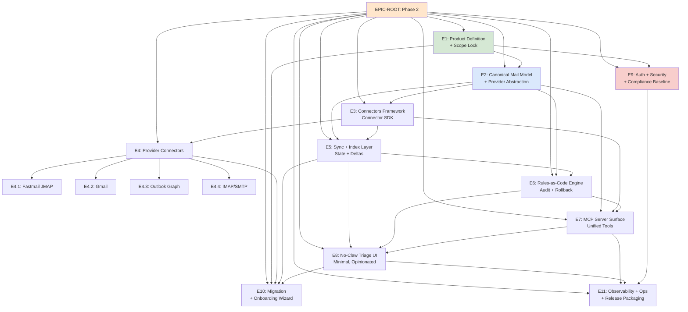

# IntentMail Phase 2 — Epics, Dependencies, Milestones

**Project ID:** 261
**Document ID:** 262
**Document Type:** Roadmap (RMAP)
**Status:** Draft - Phase 2 Planning
**Date:** 2025-12-23
**Version:** 0.1.0

---

## Overview

Phase 2 transforms IntentMail from a concept into a **programmable email control plane** with MCP integration, provider abstraction, and rules-as-code automation. This document maps the 11 core epics, their dependencies, and acceptance criteria.

**Master Epic:** `ai-devops-intent-solutions-b76`
**Title:** IntentMail — Phase 2: MCP Gateway + Rules-as-Code Email Control Plane

---

## Epic Dependency Graph



---

## Epic Details

### EPIC-ROOT: IntentMail — Phase 2

**ID:** `ai-devops-intent-solutions-b76`
**Priority:** P0
**Status:** Open

**Description:**
Master epic for Phase 2: Transform email into a programmable control plane with MCP integration, provider abstraction, and rules-as-code automation.

**Children:**
11 core epics + 4 provider connector sub-epics (15 total)

---

### E1: Product Definition + Scope Lock

**ID:** `ai-devops-intent-solutions-b76.1`
**Priority:** P1
**Status:** Open
**Blocks:** E2, E9, E10

**Purpose:**
Convert the original post into an actual build spec and V1 boundaries.

**Acceptance Criteria:**
- ✅ V1 persona + jobs-to-be-done documented
- ✅ Clear in/out-of-scope list
- ✅ MVP success metrics defined
- ✅ Technical/business constraints documented

**Key Deliverables:**
- Persona definition document
- V1 scope document (in/out)
- Success metrics baseline
- Constraints catalog

**Dependencies:** None (root planning epic)

---

### E2: Canonical Mail Model + Provider Abstraction

**ID:** `ai-devops-intent-solutions-b76.2`
**Priority:** P1
**Status:** Open
**Depends On:** E1
**Blocks:** E3, E5, E6, E7

**Purpose:**
Define normalized entities across Gmail/Outlook/Fastmail/IMAP: Message, Thread, Label/Folder, Rule, Alias, Attachment, Identity.

**Acceptance Criteria:**
- ✅ Canonical models defined with fields + identifiers
- ✅ Provider mapping documented (capability matrix)
- ✅ Data transformation rules specified

**Key Deliverables:**
- Canonical data model specification (see `262-AT-DSGN-canonical-mail-model.md`)
- Provider capability matrix
- Transformation rules per provider

**Core Entities:**
1. **Message** - Single email message (RFC 5322)
2. **Thread** - Conversation grouping
3. **Label/Folder** - Organizational taxonomy
4. **Rule** - Automation definition
5. **Alias** - Email identity/address
6. **Attachment** - File attachments
7. **Identity** - Sender identity (from/reply-to)

---

### E3: Connectors Framework (Connector SDK)

**ID:** `ai-devops-intent-solutions-b76.3`
**Priority:** P1
**Status:** Open
**Depends On:** E2
**Blocks:** E4, E5, E7

**Purpose:**
A standard interface every provider connector implements.

**Acceptance Criteria:**
- ✅ Connector interface defined
- ✅ Auth interface specified
- ✅ Delta/sync interface designed
- ✅ Local dev harness implemented
- ✅ Contract test framework ready

**Key Deliverables:**
- Connector interface specification
- Auth flow abstraction
- Sync protocol definition
- Development harness tooling
- Contract test suite template

**Interface Methods:**
```typescript
interface Connector {
  // Auth
  authenticate(credentials: Credentials): Promise<Session>;
  refreshToken(session: Session): Promise<Session>;

  // Query
  search(query: SearchQuery): Promise<MessageList>;
  getMessage(id: MessageId): Promise<Message>;
  getThread(id: ThreadId): Promise<Thread>;

  // Actions
  applyLabel(messageId, labelId): Promise<void>;
  moveMessage(messageId, folderId): Promise<void>;
  sendMessage(message: Draft): Promise<SentMessage>;

  // Sync
  getDelta(since: Timestamp): Promise<Delta>;
  getCapabilities(): Capabilities;
}
```

---

### E4: Provider Connectors

**ID:** `ai-devops-intent-solutions-b76.4`
**Priority:** P1
**Status:** Open
**Depends On:** E3
**Blocks:** E10

**Purpose:**
Implement connectors for Fastmail (JMAP), Gmail, Outlook (Graph), and IMAP/SMTP fallback.

**Acceptance Criteria:**
- ✅ All 4 connectors implemented
- ✅ Each supports: search, fetch thread, list labels, apply/move, send
- ✅ Capability flags where provider lacks features
- ✅ Integration tests passing

**Sub-Epics:**

#### E4.1: Fastmail (JMAP) Connector
**ID:** `ai-devops-intent-solutions-b76.4.1`
**Protocol:** JMAP (RFC 8620)
**Capabilities:** Full (search, threads, labels, send, delta sync)

#### E4.2: Gmail Connector
**ID:** `ai-devops-intent-solutions-b76.4.2`
**Protocol:** Gmail API v1
**Capabilities:** Full (search, threads, labels, send, push notifications)

#### E4.3: Outlook (Graph) Connector
**ID:** `ai-devops-intent-solutions-b76.4.3`
**Protocol:** Microsoft Graph API
**Capabilities:** Full (search, threads, folders, send, delta sync)

#### E4.4: IMAP/SMTP Fallback Connector
**ID:** `ai-devops-intent-solutions-b76.4.4`
**Protocol:** IMAP (RFC 3501) + SMTP
**Capabilities:** Limited (basic search, no threads, folder-only, basic send)

---

### E5: Sync + Index Layer (State + Deltas)

**ID:** `ai-devops-intent-solutions-b76.5`
**Priority:** P1
**Status:** Open
**Depends On:** E2, E3
**Blocks:** E6, E8, E10

**Purpose:**
Make "search + automation" fast and consistent.

**Acceptance Criteria:**
- ✅ Delta sync strategy per provider
- ✅ Storage schema for local index (choice: sqlite/libsql or firestore)
- ✅ Storage choice justified in ADR
- ✅ Reconciliation strategy + idempotency keys
- ✅ Full-text search working

**Key Deliverables:**
- Sync strategy document (see `262-AT-DSGN-sync-index-strategy.md`)
- Storage ADR (sqlite vs firestore)
- Index schema definition
- Reconciliation algorithm
- Idempotency implementation

**Sync Strategies by Provider:**
- **Gmail:** Push notifications + history API
- **Outlook:** Delta query with skip tokens
- **Fastmail:** JMAP push + state strings
- **IMAP:** IDLE + UID polling

---

### E6: Rules-as-Code Engine (with Audit + Rollback)

**ID:** `ai-devops-intent-solutions-b76.6`
**Priority:** P1
**Status:** Open
**Depends On:** E2, E5
**Blocks:** E8, E7

**Purpose:**
Safer-than-filters automation.

**Acceptance Criteria:**
- ✅ Rules DSL (YAML/JSON) defined + versioning strategy
- ✅ Dry run ("plan") output implemented
- ✅ Audit log for each action
- ✅ Rollback strategy for bulk actions

**Key Deliverables:**
- Rules DSL specification (see `262-AT-DSGN-rules-as-code-spec.md`)
- Dry-run engine
- Audit logging system
- Rollback mechanism

**Example Rule:**
```yaml
version: 1
name: archive-newsletters
description: Auto-archive newsletters after 7 days
conditions:
  - field: from
    operator: matches
    value: "*@substack.com"
  - field: age_days
    operator: greater_than
    value: 7
actions:
  - type: apply_label
    label: archived
  - type: remove_label
    label: inbox
audit: true
dry_run_required: false
```

---

### E7: MCP Server Surface (Unified Tools)

**ID:** `ai-devops-intent-solutions-b76.7`
**Priority:** P1
**Status:** Open
**Depends On:** E2, E3
**Integrates With:** E4, E5, E6
**Blocks:** E8, E11

**Purpose:**
One MCP server that feels stable regardless of backend provider.

**Acceptance Criteria:**
- ✅ Tool schema + error model + pagination standards
- ✅ Minimal 10+ tools implemented
- ✅ Provider routing + capability reporting

**Key Deliverables:**
- MCP tool contract (see `262-AT-APIS-mcp-tool-contract.md`)
- 10+ tool implementations
- Error handling framework
- Capability reporting system

**Core Tools (10+):**
1. `search_messages` - Search across all mailboxes
2. `get_message` - Fetch full message with headers/body
3. `get_thread` - Fetch conversation thread
4. `apply_label` - Add label to message(s)
5. `move_message` - Move to folder
6. `create_rule` - Define automation rule
7. `run_rule_plan` - Dry-run a rule
8. `send_message` - Send email
9. `list_identities` - List sender identities/aliases
10. `create_alias` - Create new email alias

---

### E8: "No-Claw" Triage UI (Minimal, Opinionated)

**ID:** `ai-devops-intent-solutions-b76.8`
**Priority:** P1
**Status:** Open
**Depends On:** E7, E6, E5
**Blocks:** E10, E11

**Purpose:**
UI optimized for triage + automation, not reading every email.

**Acceptance Criteria:**
- ✅ Inbox queue view implemented
- ✅ Thread view working
- ✅ Rule builder + "dry-run plan" viewer
- ✅ Action log viewer (audit)
- ✅ Responsive design
- ✅ Keyboard shortcuts

**Key Deliverables:**
- Inbox queue component
- Thread viewer
- Rule builder UI
- Dry-run plan viewer
- Action audit log
- Keyboard shortcut system

**Philosophy:**
- **No endless scrolling** - Queue-based triage
- **No distractions** - Minimal chrome, focus on action
- **Automation-first** - Rules > manual processing
- **Audit everything** - Transparency in all actions

---

### E9: Auth + Security + Compliance Baseline

**ID:** `ai-devops-intent-solutions-b76.9`
**Priority:** P1
**Status:** Open
**Depends On:** E1
**Supports:** All epics
**Blocks:** E11

**Purpose:**
Token handling, scopes, encryption, audit posture.

**Acceptance Criteria:**
- ✅ Secret storage policy + rotation guidance
- ✅ OAuth device flow or local callback flow (per provider)
- ✅ RBAC boundaries (even if single-user now)
- ✅ Threat model + mitigations

**Key Deliverables:**
- Security baseline document (see `262-AT-DSGN-security-auth-baseline.md`)
- Token storage implementation
- OAuth flow per provider
- RBAC design
- Threat model + mitigations

**Security Principles:**
1. **Zero trust** - Never trust, always verify
2. **Least privilege** - Minimal scopes required
3. **Defense in depth** - Multiple security layers
4. **Audit everything** - Comprehensive logging
5. **Encrypt everything** - At rest and in transit

---

### E10: Migration + Onboarding Wizard

**ID:** `ai-devops-intent-solutions-b76.10`
**Priority:** P1
**Status:** Open
**Depends On:** E1, E4, E5, E8
**Blocks:** None (end-user facing)

**Purpose:**
Make switching from Gmail/Outlook plausible.

**Acceptance Criteria:**
- ✅ Domain DNS checklist (MX/SPF/DKIM/DMARC) doc + UI checklist
- ✅ Import strategy (provider by provider)
- ✅ "Cutover mode" plan (dual-delivery or forwarding)

**Key Deliverables:**
- DNS setup wizard
- Import flow per provider
- Cutover strategy guide
- Onboarding checklist

**Migration Paths:**
1. **Gmail → IntentMail:** OAuth + import API
2. **Outlook → IntentMail:** Graph API + import
3. **Fastmail → IntentMail:** JMAP import
4. **Other → IntentMail:** IMAP migration

---

### E11: Observability + Ops + Release Packaging

**ID:** `ai-devops-intent-solutions-b76.11`
**Priority:** P1
**Status:** Open
**Depends On:** E7, E8, E9
**Blocks:** None (final epic)

**Purpose:**
Run it, test it, ship it.

**Acceptance Criteria:**
- ✅ Logging/tracing conventions defined
- ✅ Integration test plan + fixture accounts strategy
- ✅ Packaging + versioning + release checklist

**Key Deliverables:**
- Observability standards
- Integration test suite
- Release packaging
- Version strategy
- Deployment guide

**Observability Stack:**
- **Logging:** Structured JSON logs
- **Tracing:** OpenTelemetry
- **Metrics:** Prometheus
- **Dashboards:** Grafana
- **Alerting:** PagerDuty/OpsGenie

---

## Dependency Summary

| Epic | Depends On | Blocks |
|------|-----------|--------|
| E1 | None | E2, E9, E10 |
| E2 | E1 | E3, E5, E6, E7 |
| E3 | E2 | E4, E5, E7 |
| E4 | E3 | E10 |
| E5 | E2, E3 | E6, E8, E10 |
| E6 | E2, E5 | E8, E7 |
| E7 | E2, E3, (E4, E5, E6 integrate) | E8, E11 |
| E8 | E7, E6, E5 | E10, E11 |
| E9 | E1 | E11 (supports all) |
| E10 | E1, E4, E5, E8 | None |
| E11 | E7, E8, E9 | None |

---

## Milestones

### Milestone 1: Foundation (E1, E2, E3)
**Target:** Weeks 1-2
**Deliverables:**
- Product definition complete
- Canonical model defined
- Connector SDK specified

### Milestone 2: Provider Integration (E4, E5)
**Target:** Weeks 3-5
**Deliverables:**
- All 4 connectors implemented
- Sync + index layer working
- Delta sync operational

### Milestone 3: Automation Core (E6, E7)
**Target:** Weeks 6-7
**Deliverables:**
- Rules engine with audit
- MCP server with 10+ tools
- Dry-run functionality

### Milestone 4: User Experience (E8, E9)
**Target:** Weeks 8-9
**Deliverables:**
- Triage UI complete
- Auth + security baseline
- End-to-end user flow

### Milestone 5: Production Ready (E10, E11)
**Target:** Weeks 10-12
**Deliverables:**
- Migration wizard
- Observability stack
- Release packaging
- V1.0 launch

---

## Critical Path

The critical path through the dependency graph is:

```
E1 → E2 → E3 → E4 → E5 → E6 → E7 → E8 → E11
```

**Estimated Duration:** 12 weeks (aggressive)

**Parallelization Opportunities:**
- E4.1, E4.2, E4.3, E4.4 can be built in parallel
- E9 can proceed in parallel with E4/E5/E6
- E10 can start during E8 development

---

## Risk Register

| Risk | Impact | Mitigation |
|------|--------|-----------|
| Provider API rate limits | High | Implement backoff + caching strategies |
| OAuth flow complexity | Medium | Start with device flow, add callback later |
| Sync conflicts | High | Implement idempotency + conflict resolution |
| Rules engine bugs | Critical | Require dry-run for destructive operations |
| Security vulnerabilities | Critical | Security review at every milestone |
| Scope creep | High | Strict adherence to V1 scope lock (E1) |

---

## Success Metrics

### Phase 2 Completion Criteria
- [ ] All 11 epics closed
- [ ] All acceptance criteria met
- [ ] Integration tests passing (>95% coverage)
- [ ] Security audit complete
- [ ] Documentation complete
- [ ] V1.0 release packaged

### User Success Metrics (Post-Launch)
- **Sync latency:** < 30 seconds
- **Search latency:** < 500ms
- **Rule execution:** < 5 seconds
- **UI responsiveness:** < 200ms interactions
- **Uptime:** > 99.5%
- **Error rate:** < 1%

---

## Related Documents

- `261-PP-PROD-intentmail-project-brief.md` - Phase 1 project brief
- `261-AT-ARCH-intentmail-architecture-overview.md` - Phase 1 architecture
- `262-AT-DSGN-canonical-mail-model.md` - Canonical model spec
- `262-AT-APIS-mcp-tool-contract.md` - MCP tool definitions
- `262-AT-DSGN-rules-as-code-spec.md` - Rules engine spec
- `262-AT-DSGN-sync-index-strategy.md` - Sync strategy
- `262-AT-DSGN-security-auth-baseline.md` - Security baseline

---

**Document Status:** Draft - Phase 2 Planning
**Next Review:** After E1 completion
**Owner:** Jeremy Longshore
**Beads Epic:** `ai-devops-intent-solutions-b76`
